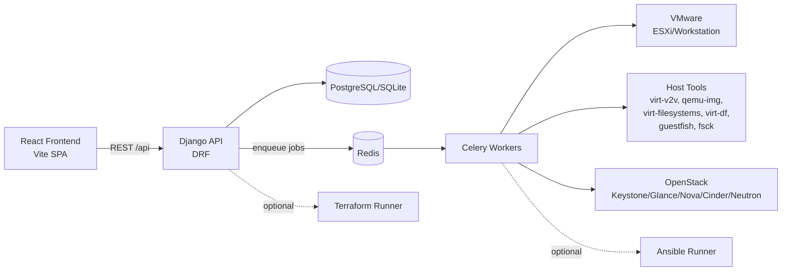

# VM Migrator

VM Migrator is a Django + Celery orchestration platform that migrates virtual machines from VMware (Workstation/ESXi) to OpenStack with validation, integrity checks, and rollback automation.

This README is written for:
- Production operations teams deploying and running the platform.
- Support/maintenance teams triaging incidents and troubleshooting migration jobs.

## What This Project Does

- Discovers VMware VMs and persists inventory (`DiscoveredVM`).
- Creates migration jobs (`MigrationJob`) from selected VMs.
- Executes migration asynchronously through Celery workers.
- Converts disks using host tools (`virt-v2v`, `qemu-img`, `libguestfs` utilities).
- Uploads artifacts to OpenStack and validates deployed resources.
- Triggers rollback/cleanup on failure when enabled.

## Architecture



## Migration Lifecycle

### Job states

`PENDING -> DISCOVERED -> PRECHECK -> SNAPSHOT_CREATED -> DISK_ANALYZING -> CONVERTING -> BLOCK_VALIDATING -> UPLOADING -> DEPLOYED -> VERIFIED`

Failure path:

`<any active state> -> FAILED -> ROLLED_BACK`

### Pipeline summary

1. Discovery reads VMware inventory and stores VM metadata.
2. Precheck validates source disk/datastore and migration prerequisites.
3. Snapshot is created for ESXi jobs (when applicable).
4. Disk strategy is selected (`individual` or `concat`).
5. Conversion runs and artifacts are block/filesystem validated.
6. OpenStack image/volume/server resources are created and verified.
7. Failures trigger rollback cleanup if rollback is enabled.

## Repository Layout

```text
backend/
  core/                      Django settings, URL config, Celery/logging config
  migrations/                Models, serializers, task pipeline, provider clients
frontend/                    React SPA (Vite)
ansible/                     Optional conversion playbooks
terraform/                   Optional OpenStack infra provisioning
```

## Production Safety Notes

- API authentication is not enforced at the view level (`AllowAny` is used on endpoints).
- Protect API access with network controls and reverse proxy auth (VPN, private subnet, mTLS, SSO/OIDC gateway, or IP allow-list).
- Credentials for VMware/OpenStack endpoint sessions are persisted in DB fields. Use encrypted storage at rest and strict DB access controls.
- Keep risky feature flags disabled by default and enable them per environment only after validation.

## Prerequisites

### Core runtime

- Python 3 with `venv`
- Node.js + npm (frontend)
- Redis (Celery broker/result backend)
- Database (SQLite for dev, PostgreSQL/MySQL recommended for production)

### Migration host tools (worker node)

Install and validate availability of:
- `virt-v2v`
- `qemu-img`
- `virt-filesystems`
- `virt-df`
- `guestfish`
- `fsck`

Recommended check:

```bash
which virt-v2v qemu-img virt-filesystems virt-df guestfish fsck
```

### Optional tools

- `ansible-playbook` (if `ENABLE_ANSIBLE_CONVERSION=true`)
- `terraform` (if `ENABLE_TERRAFORM_INFRA=true`)
- `nbdkit` + VMware VDDK plugin/filter libs for ESXi `vddk` transport

## Quick Start (Local Validation)

### 1) Backend

```bash
cd backend
python3 -m venv .venv
source .venv/bin/activate
pip install Django djangorestframework celery redis django-environ dj-database-url \
  pyvmomi openstacksdk mysqlclient psycopg2-binary
cp .env.example .env
python manage.py migrate
python manage.py runserver 0.0.0.0:8000
```

### 2) Worker

```bash
cd backend
source .venv/bin/activate
celery -A core worker -l info --concurrency=${CELERY_WORKER_CONCURRENCY:-2}
```

### 3) Optional: periodic discovery scheduler

```bash
cd backend
source .venv/bin/activate
celery -A core beat -l INFO
```

### 4) Frontend

```bash
cd frontend
cp .env.example .env
# Set VITE_API_BASE_URL=http://<backend-host>:8000
npm install
npm run dev -- --host
```

## Production Deployment Model

Run at least these long-lived processes:
- `django-api`: `python manage.py runserver ...` (or gunicorn/uwsgi in production)
- `celery-worker`: `celery -A core worker -l info ...`
- `redis`: broker/backend
- `frontend static hosting`: serve `frontend/dist` and proxy `/api/` to backend

Optional process:
- `celery-beat` if periodic VMware discovery is enabled.

Recommended separation:
- API and worker can be on separate nodes.
- Worker node should have VMware/OpenStack connectivity and host conversion tools installed.

## Configuration Reference (`backend/.env`)

Start from `backend/.env.example`.

### Required baseline

- `SECRET_KEY`: strong random value
- `DEBUG=false`
- `ALLOWED_HOSTS`: production hostnames
- `DATABASE_URL`: PostgreSQL/MySQL recommended in production
- `REDIS_URL`
- `TIME_ZONE`

### Key feature flags

- `ENABLE_REAL_CONVERSION`: run actual conversion (`false` means dry/stub behavior)
- `ENABLE_OPENSTACK_DEPLOYMENT`: create real OpenStack resources
- `ENABLE_ROLLBACK`: enable rollback task on failures
- `ENABLE_PERIODIC_DISCOVERY`: enables Celery beat schedule
- `ENABLE_ANSIBLE_CONVERSION`: use Ansible conversion path
- `ENABLE_TERRAFORM_INFRA`: allow Terraform provisioning
- `ENABLE_TERRAFORM_FROM_CELERY`: allow Terraform runs from async task

### VMware settings

- `VMWARE_WORKSTATION_PATHS`
- `VMWARE_ESXI_HOST`
- `VMWARE_ESXI_PORT`
- `VMWARE_ESXI_USERNAME`
- `VMWARE_ESXI_PASSWORD`
- `VMWARE_ESXI_INSECURE`
- `VMWARE_ESXI_CONVERSION_TRANSPORT` (`vddk` or `libvirt_esx`)
- `VMWARE_VDDK_LIBDIR`
- `VMWARE_VDDK_THUMBPRINT`
- `VMWARE_VDDK_NBDKIT_PLUGIN_PATH`
- `VMWARE_NBDKIT_BIN`
- `VMWARE_NBDKIT_FILTER_PATH`
- `VMWARE_REQUIRE_NO_SNAPSHOTS`

### Conversion and artifact settings

- `MIGRATION_OUTPUT_DIR`
- `VIRT_V2V_TIMEOUT_SECONDS`
- `ENABLE_ARTIFACT_BACKUP`
- `ARTIFACT_BACKUP_DIR`
- `ARTIFACT_BACKUP_REQUIRED`

### OpenStack settings

- `OPENSTACK_CLOUD_NAME`
- `OPENSTACK_DEFAULT_NETWORK`
- `OPENSTACK_IMAGE_ENDPOINT_OVERRIDE`
- `OPENSTACK_VERIFY_TIMEOUT`
- `OPENSTACK_VERIFY_POLL_INTERVAL`
- `OPENSTACK_IMAGE_UPLOAD_TIMEOUT`
- `OPENSTACK_IMAGE_UPLOAD_POLL_INTERVAL`
- `OPENSTACK_API_RETRIES`
- `OPENSTACK_API_RETRY_DELAY`

Auth can come from:
- Stored endpoint session via API (`/api/openstack/endpoints/connect`), or
- `OS_*` env vars (`OS_AUTH_URL`, `OS_USERNAME`, `OS_PASSWORD`, ...), or
- `clouds.yaml` with `OPENSTACK_CLOUD_NAME`.

### Logging settings

- `LOG_LEVEL`
- `LOG_DIR`
- `APP_LOG_MAX_BYTES`, `APP_LOG_BACKUP_COUNT`
- `WORKER_LOG_MAX_BYTES`, `WORKER_LOG_BACKUP_COUNT`

Logs are written to:
- `backend/logs/app.log`
- `backend/logs/worker.log`

## API Reference

Base path: `/api`

### Health

- `GET /health`
- `GET /openstack/health`

### VMware

- `GET /vmware/vms`
- `POST /vmware/discover-now`
- `POST /vmware/endpoints/test`
- `POST /vmware/endpoints/connect`

### OpenStack

- `GET /openstack/images`
- `GET /openstack/flavors`
- `GET /openstack/networks`
- `POST /openstack/endpoints/test`
- `POST /openstack/endpoints/connect`

### Migrations

- `GET /migrations`
- `GET /migrations/<job_id>`
- `POST /migrations/from-vmware`
- `POST /migrations/<job_id>/start`
- `POST /migrations/<job_id>/rollback`

### Async task status

- `GET /tasks/<task_id>`

### OpenStack provisioning

- `POST /openstack/provision`
- `GET /openstack/provision/status`

## Common Request Payloads

### Test VMware endpoint

```json
{
  "label": "esxi-lab-1",
  "host": "10.0.0.20",
  "port": 443,
  "username": "root",
  "password": "***",
  "insecure": true
}
```

### Connect OpenStack endpoint

```json
{
  "label": "devstack-lab",
  "auth_url": "http://10.0.0.30/identity",
  "username": "admin",
  "password": "***",
  "project_name": "admin",
  "user_domain_name": "Default",
  "project_domain_name": "Default",
  "region_name": "RegionOne",
  "interface": "public",
  "identity_api_version": "3",
  "verify": false,
  "image_endpoint_override": ""
}
```

### Create migration jobs from discovered VMs

```json
{
  "vmware_endpoint_session_id": 1,
  "openstack_endpoint_session_id": 3,
  "vms": [
    {
      "name": "web-01",
      "source": "esxi",
      "overrides": {
        "flavor_id": "m1.medium",
        "disk_layout_mode": "individual",
        "network": {
          "network_id": "a1b2c3d4-...",
          "fixed_ip": "192.168.100.25"
        }
      }
    }
  ]
}
```

`disk_layout_mode` accepted values:
- `individual` (default)
- `concat` (also accepts `merge`/`concatenate` aliases)

## Operations Runbook

### Bring-up checks

1. `GET /api/health` returns `{"status":"ok"}`.
2. Redis reachable from API and worker nodes.
3. Worker running and can execute `migrations.celery_ping` or any queued task.
4. `backend/logs/app.log` and `backend/logs/worker.log` are being written.

### Discovery flow

1. Configure VMware endpoint (`/api/vmware/endpoints/connect`).
2. Trigger discovery (`/api/vmware/discover-now`).
3. Poll task state (`/api/tasks/<task_id>`).
4. Verify inventory (`/api/vmware/vms`).

### Migration flow

1. Create jobs (`/api/migrations/from-vmware`).
2. Poll list/detail (`/api/migrations`, `/api/migrations/<id>`).
3. If needed, force start (`/api/migrations/<id>/start`).
4. On failed jobs, trigger rollback (`/api/migrations/<id>/rollback`).

### OpenStack infra provisioning (optional)

1. Ensure `ENABLE_TERRAFORM_INFRA=true`.
2. If async provisioning is required, set `ENABLE_TERRAFORM_FROM_CELERY=true`.
3. Trigger provisioning (`/api/openstack/provision`) with optional `var_overrides`.
4. Check `/api/openstack/provision/status`.

## Troubleshooting Guide

### `No DiscoveredVM found for vm_name=...`

Cause:
- Selected VM is stale or endpoint session mismatch.

Checks:
- Re-run discovery for the same VMware endpoint session.
- Verify `source` and `vmware_endpoint_session_id` used in migration creation.

### `VMWARE_ESXI_* required` errors during conversion

Cause:
- Missing ESXi credentials/host in worker environment.

Checks:
- Ensure worker process has `VMWARE_ESXI_HOST`, `VMWARE_ESXI_USERNAME`, `VMWARE_ESXI_PASSWORD`.

### `libguestfs cannot read host kernel image`

Cause:
- Host kernel image permissions block libguestfs/supermin.

Checks:
- Confirm `/boot/vmlinuz-<release>` is readable by worker user (or run worker with proper permissions).

### Conversion artifacts missing / no QCOW2 produced

Cause:
- `virt-v2v` failure, output path issues, or disk tool errors.

Checks:
- Validate `MIGRATION_OUTPUT_DIR` exists and is writable.
- Inspect worker logs for `ConversionExecutionError` and command stderr.
- Check free disk space on worker host.

### OpenStack upload or server verification timeout

Cause:
- Slow image import, connectivity, wrong endpoint, or cloud resource limits.

Checks:
- Increase `OPENSTACK_IMAGE_UPLOAD_TIMEOUT` / `OPENSTACK_VERIFY_TIMEOUT`.
- Verify `OPENSTACK_IMAGE_ENDPOINT_OVERRIDE` if Glance endpoint is non-standard.
- Confirm credentials, network, flavor, and quota availability.

### Provisioning reports `SKIPPED`

Cause:
- Terraform feature flags disabled.

Checks:
- Set `ENABLE_TERRAFORM_INFRA=true`.
- Set `ENABLE_TERRAFORM_FROM_CELERY=true` for API-triggered async provisioning.

## Frontend Notes

Frontend env:

```env
VITE_API_BASE_URL=http://<BACKEND_HOST>:8000
```

Production frontend:

```bash
cd frontend
npm install
npm run build
```

Serve `frontend/dist` from web server and proxy `/api/` to backend.

## Support Handoff Checklist

- `.env` values are documented per environment (dev/stage/prod).
- Feature flags are explicitly reviewed before go-live.
- Worker host has conversion binaries installed and validated.
- Redis and DB backup/retention policy exists.
- Log retention and central aggregation are configured.
- Runbook for rollback and failed-job triage is shared with on-call support.
