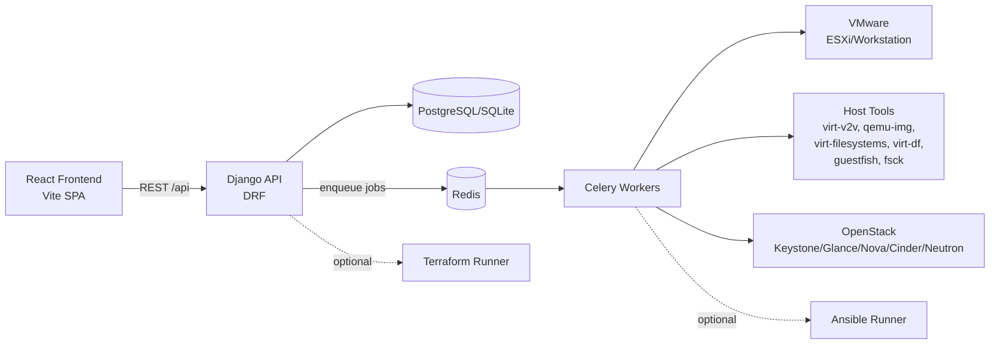
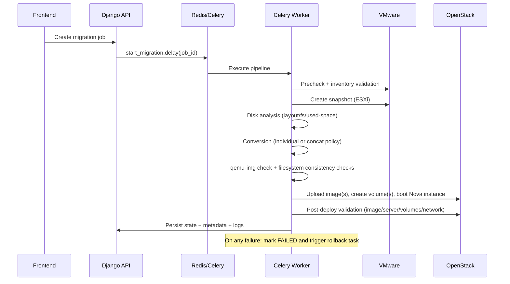
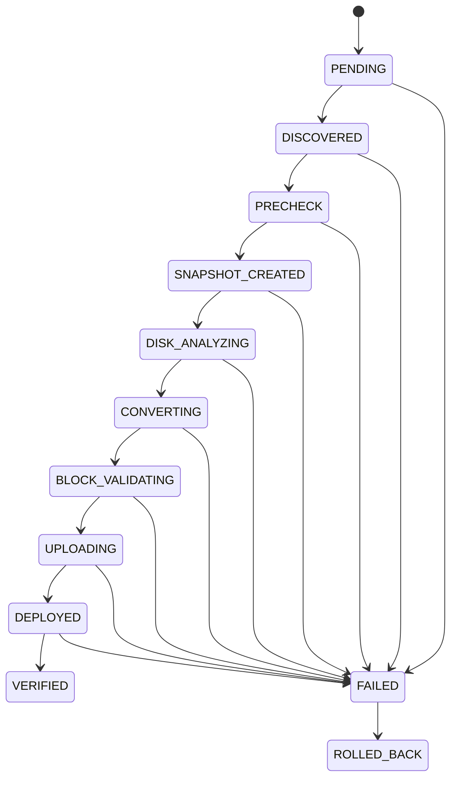
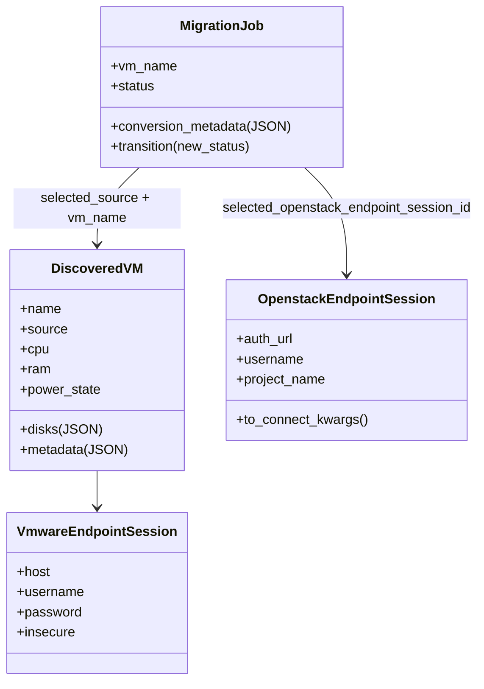

# VM Migrator

VM Migrator is a Django + Celery orchestration platform for migrating virtual machines from VMware (Workstation/ESXi via `pyVmomi`) to OpenStack (via `openstacksdk`) with validation-first execution, integrity checks, structured observability, and rollback safety.

## Architecture Overview

### System Context


### Runtime Flow


## Components And Roles

### Frontend (`frontend/`)
- Migration dashboard and job drill-down views.
- VMware/OpenStack endpoint onboarding UX.
- Polling and status rendering for migration lifecycle states.

### Backend API (`backend/core`, `backend/migrations/views.py`)
- Exposes REST endpoints for discovery, job creation, job status, and manual rollback.
- Validates user requests and persists normalized migration intent.
- Triggers Celery tasks and returns async-facing payloads.

### Migration Domain (`backend/migrations/`)
- `models.py`: persistent entities and state machine rules.
- `tasks.py`: orchestration pipeline, retries, rollback scheduling, idempotency guards.
- `vmware_client.py`: VMware read-only discovery via `pyVmomi`.
- `openstack_deployment.py`: OpenStack resource lifecycle helpers.
- `conversion.py`: conversion planning for `virt-v2v` / per-disk conversion strategy.
- `disk_formats.py`: source format detection and `qemu-img convert` wrappers.
- `disk_inspection.py`: precheck disk metadata, datastore/disk validation, concat helper.
- `snapshot_manager.py`: ESXi snapshot creation for rollback safety.
- `block_validation.py`: block-level post-conversion checks via `qemu-img check`.
- `filesystem_check.py`: filesystem/partition consistency checks (`virt-filesystems`, `guestfish`, `fsck`).

### Celery + Redis
- Redis is broker + result backend.
- Celery workers execute heavy/long-running operations outside API request threads.
- Supports resilient, asynchronous orchestration with state persistence.

### External Systems
- VMware source of truth for VM config/disks/snapshot operations.
- OpenStack target platform for image upload, volume creation, and Nova deployment.
- Host virtualization tools provide conversion and integrity/consistency checks.

## Migration State Machine



### State Intent
- `PRECHECK`: VM state/config/disk/datastore validation and source metadata collection.
- `SNAPSHOT_CREATED`: source rollback point created (ESXi).
- `DISK_ANALYZING`: filesystem/layout/used-space analysis and disk strategy selection.
- `CONVERTING`: disk conversion execution (individual or concatenated according to policy).
- `BLOCK_VALIDATING`: `qemu-img check` and filesystem consistency checks on outputs.
- `UPLOADING` / `DEPLOYED` / `VERIFIED`: OpenStack deployment + post-migration verification.

## Domain Model



## Pipeline Responsibilities (Step-by-Step)

1. Discovery:
- Pull VM inventory from VMware.
- Persist `DiscoveredVM` records with disk and metadata details.

2. Pre-migration validation:
- Verify source VM status and disk configuration.
- Validate datastore metadata and source disk accessibility.
- Run source-side checks (including `qemu-img check` where possible).
- Collect disk/filesystem/partition metadata.

3. Snapshot:
- Create ESXi snapshot before conversion to guarantee rollback point.

4. Disk handling:
- Detect multi-disk topology.
- Policy `individual`: convert all disks independently (1:1 mapping preserved).
- Policy `concat`: concatenate converted disk payloads into one target image with mapping metadata.

5. Conversion and integrity:
- Execute `virt-v2v` or `qemu-img` conversion workflows.
- Validate resulting artifacts using `qemu-img check`.
- Run filesystem consistency/partition checks.

6. OpenStack deployment + verification:
- Upload image(s) to Glance.
- Create Cinder volume(s), boot Nova server, attach remaining disks.
- Validate image status, server status (`ACTIVE`), flavor/network expectations, and volume presence.

7. Failure and rollback:
- Any critical failure transitions job to `FAILED`.
- Rollback task removes created OpenStack resources and temp artifacts.
- Job final state becomes `ROLLED_BACK` when cleanup succeeds.

## Technology Stack
- Backend: Django, Django REST Framework
- Async: Celery
- Queue/backend: Redis
- VMware: `pyVmomi`
- OpenStack: `openstacksdk`
- Conversion/validation tools: `virt-v2v`, `qemu-img`, `virt-filesystems`, `virt-df`, `guestfish`, `fsck`
- Frontend: React + Vite
- Optional automation: Ansible, Terraform

## Repository Structure
```text
backend/
  core/                      # Django settings, URL root, celery/logging config
  migrations/                # Domain models, tasks, clients, validation/conversion helpers
frontend/                    # React SPA
ansible/                     # Optional conversion playbooks
terraform/                   # Optional infra provisioning modules
```

## API Surface (Current)
Base path: `/api`

- `Health`: `GET /health`, `GET /openstack/health`
- `VMware`: `GET /vmware/vms`, `POST /vmware/discover-now`, `POST /vmware/endpoints/test`, `POST /vmware/endpoints/connect`
- `OpenStack`: `GET /openstack/images`, `GET /openstack/flavors`, `GET /openstack/networks`, `POST /openstack/endpoints/test`, `POST /openstack/endpoints/connect`
- `Migrations`: `GET /migrations`, `GET /migrations/<job_id>`, `POST /migrations/from-vmware`, `POST /migrations/<job_id>/start`, `POST /migrations/<job_id>/rollback`
- `Provisioning`: `POST /openstack/provision`, `GET /openstack/provision/status`

## Configuration Highlights
- Feature flags control risky operations.
- `ENABLE_REAL_CONVERSION`
- `ENABLE_OPENSTACK_DEPLOYMENT`
- `ENABLE_ROLLBACK`
- `ENABLE_ANSIBLE_CONVERSION`
- `ENABLE_TERRAFORM_INFRA`
- `ENABLE_TERRAFORM_FROM_CELERY`

OpenStack credentials can be supplied via session records and/or `clouds.yaml` (`OPENSTACK_CLOUD_NAME`).

## Local Runbook

### Backend
```bash
cd /home/amin/Desktop/vm-migrator/backend
python3 -m venv .venv
source .venv/bin/activate
pip install Django djangorestframework celery redis django-environ dj-database-url \
  pyvmomi openstacksdk mysqlclient psycopg2-binary
cp .env.example .env
python manage.py migrate
python manage.py runserver 0.0.0.0:8000
```

### Worker
```bash
cd /home/amin/Desktop/vm-migrator/backend
source .venv/bin/activate
celery -A core worker -l info --concurrency=${CELERY_WORKER_CONCURRENCY:-2}
```

### Frontend
```bash
cd /home/amin/Desktop/vm-migrator/frontend
cp .env.example .env
# Set VITE_API_BASE_URL=http://<backend-host>:8000
npm install
npm run dev -- --host
```
