# VM Migrator

## 1. Executive Summary

VM Migrator is an orchestration platform that migrates virtual machines from VMware (ESXi and Workstation/Fusion sources) to OpenStack. It combines a Django REST API, Celery workers, and infrastructure tooling (Terraform and Ansible, optional) to run discovery, conversion, validation, deployment, and rollback workflows.

The system exists to reduce manual migration effort, standardize migration quality controls, and provide operational visibility across the migration lifecycle.

It solves these core problems:
- Coordinating long-running VM conversion/deployment tasks safely and asynchronously.
- Preserving disk architecture and validating image integrity before deployment.
- Mapping source VM specs to OpenStack targets with operational overrides.
- Supporting failure handling and automated rollback cleanup.

Infrastructure involved:
- VMware endpoints (ESXi/vCenter and local Workstation paths).
- OpenStack APIs (Keystone, Glance, Nova, Cinder, Neutron).
- Worker hosts with virtualization tooling (`virt-v2v`, `qemu-img`, libguestfs tools).
- Redis-backed asynchronous execution and optional Terraform-based network/security bootstrap.

## 2. Business Context

This platform is intended for migration programs where legacy VMware workloads are moved to OpenStack with repeatable operational controls.

Primary stakeholders:
- Platform operations teams running migration waves.
- Cloud engineers managing OpenStack target environments.
- Support/on-call teams troubleshooting migration failures.
- Technical leadership tracking migration progress and risk.

Operational needs addressed:
- Batch and repeated migration runs with status traceability.
- Endpoint onboarding/testing for both VMware and OpenStack.
- Precheck validation before risky operations.
- Post-migration verification and rollback automation.

Typical use cases:
- Lift-and-shift of ESXi VMs to OpenStack boot-from-volume instances.
- Controlled migration of local Workstation VMs.
- OpenStack baseline network/security provisioning before migration windows.

Infrastructure constraints inferred from code:
- ESXi migrations require source VM powered off.
- Worker node must have conversion binaries and adequate local storage.
- OpenStack credentials and endpoint configuration must be valid and reachable from worker/API runtime.

## 3. Technical Context

Environment characteristics:
- Backend: Python + Django + Django REST Framework.
- Async execution: Celery with Redis as broker/result backend.
- Frontend: React + Vite SPA.
- Infra automation: Terraform modules for OpenStack networking/security and optional Ansible conversion runner.

Operating system assumptions:
- Linux worker environment (libguestfs checks reference `/boot/vmlinuz-*` readability).
- Host-level conversion tools available in PATH.

Network and integration context:
- API and worker need egress to VMware and OpenStack endpoints.
- API and worker require Redis connectivity.
- Frontend communicates with backend `/api` endpoints.
- Optional VDDK transport requires `nbdkit` plugin/filter path configuration.

## 4. System Overview

Major components:
- `frontend/`: UI for endpoint connection, VM selection, migration submission, and job tracking.
- `backend/core`: Django settings, URL routing, Celery app, JSON logging config.
- `backend/migrations`: Domain models, REST views, serializers, task orchestration pipeline, provider clients, validation helpers.
- `terraform/`: OpenStack network/router/security group baseline provisioning.
- `ansible/`: Optional remote conversion playbook execution path.

Core domain entities:
- `MigrationJob`: migration lifecycle and metadata state.
- `DiscoveredVM`: discovered inventory with source metadata and disk/network details.
- `VmwareEndpointSession`: VMware connection profiles.
- `OpenstackEndpointSession`: OpenStack connection profiles.
- `OpenStackProvisioningRun`: async Terraform provisioning run tracking.

## 5. High-Level Architecture

Architecture layers:
- Infrastructure layer: VMware + OpenStack + worker host conversion toolchain.
- Service layer: Django API + Celery worker + optional Terraform/Ansible runners.
- Data layer: Django database + Redis broker/result backend.
- Integration layer: pyVmomi, openstacksdk, qemu/libguestfs CLI tools.

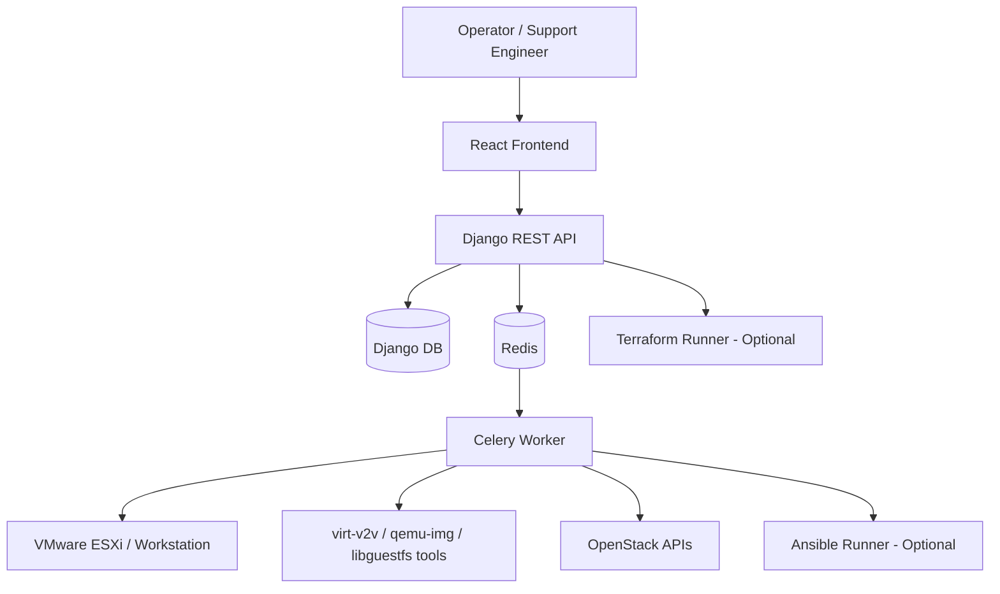

## 6. C4 Architecture Model

### 6.1 System Context Diagram

The VM Migrator system sits between operators and virtualization platforms, orchestrating migration and infrastructure tasks.

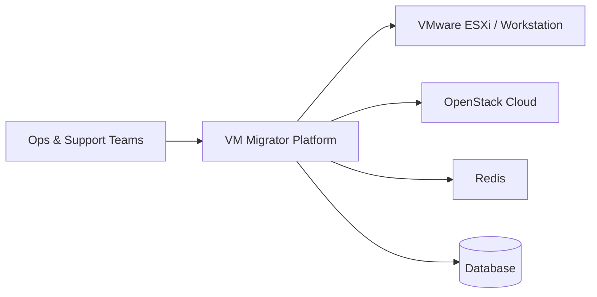

### 6.2 Container Diagram

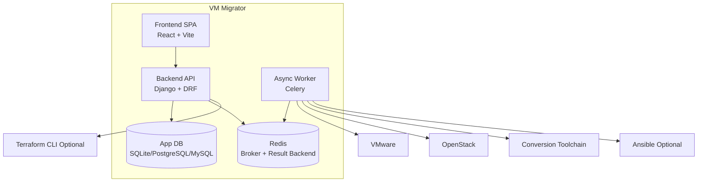

### 6.3 Component Diagram

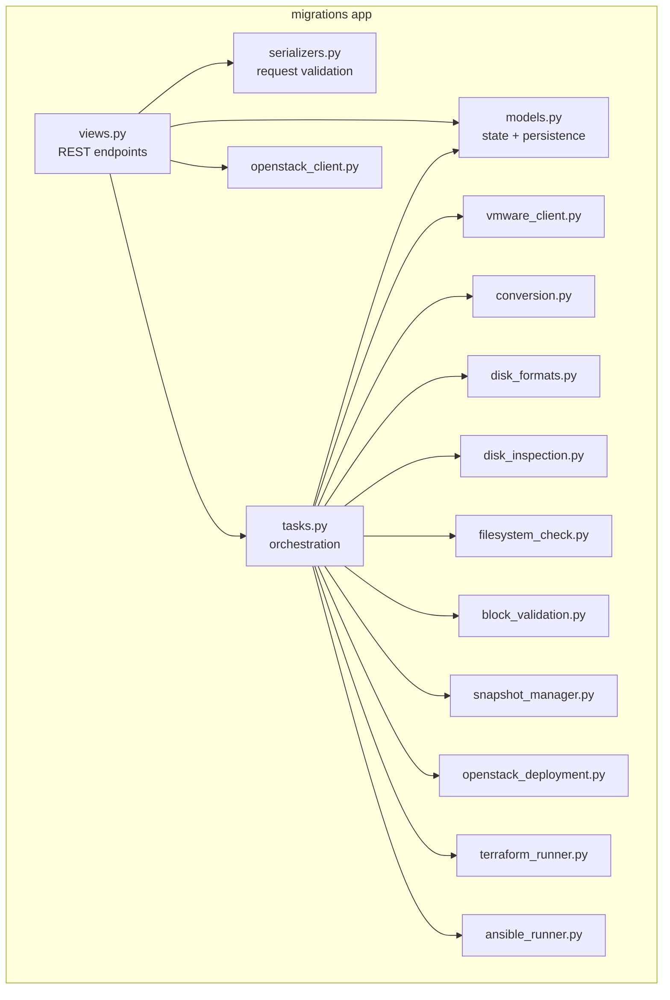

Responsibilities:
- `views.py`: external API contract and async task enqueueing.
- `serializers.py`: endpoint payload validation, OpenStack resource validation, spec normalization.
- `tasks.py`: end-to-end migration state machine and rollback behavior.
- `openstack_deployment.py`: idempotent OpenStack create/attach/verify/delete helpers.
- `disk_*` modules: conversion detection, image checks, filesystem checks, disk layout handling.

### 6.4 Deployment Diagram

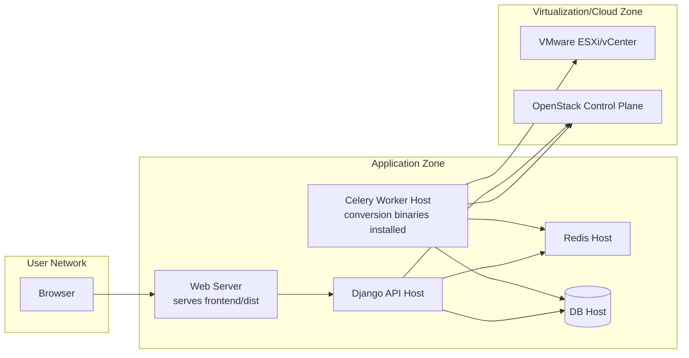

## 7. Technology Stack

| Technology | Category | Role |
| --- | --- | --- |
| Python | Programming Language | Backend logic, orchestration helpers, provider integrations |
| Django | Web Framework | API framework, model persistence, admin, settings management |
| Django REST Framework | API Framework | Request/response serialization and endpoint construction |
| Celery | Async Task Queue | Executes long-running migration, discovery, rollback, provisioning tasks |
| Redis | Messaging/State Backend | Celery broker and result backend |
| pyVmomi | VMware SDK | ESXi/vCenter inventory and metadata retrieval |
| openstacksdk | OpenStack SDK | Image, compute, volume, and networking operations |
| virt-v2v | Conversion Tool | VM conversion path (ESXi and optional workflows) |
| qemu-img | Disk Tooling | Image conversion and integrity checks (`qemu-img check`) |
| libguestfs tools (`virt-filesystems`, `virt-df`, `guestfish`) | Validation Tooling | Partition and filesystem inspection/validation |
| Ansible | Automation Tool | Optional remote conversion execution path |
| Terraform | IaC Tool | Optional OpenStack network/router/security baseline provisioning |
| React | Frontend Library | Operator UI for inventory selection and migration monitoring |
| Vite | Build/Dev Tool | Frontend development server and production bundle |
| ESLint | Static Analysis | Frontend linting and code quality checks |

Why these technologies are used:
- Django + DRF provide fast API iteration and robust model lifecycle management.
- Celery + Redis decouple user request latency from long migration tasks.
- VMware/OpenStack SDKs provide API-native integration for endpoint discovery and deployment.
- Conversion CLI tools enable practical image conversion and integrity validation on worker hosts.
- Terraform and Ansible provide optional infrastructure and automation standardization.

## 8. Infrastructure Architecture

Infrastructure perspective:
- Compute: API host(s), Celery worker host(s), optional separate frontend host.
- Virtualization: VMware as source hypervisor, OpenStack as target cloud.
- Networking: private tenant network + subnet + router via Terraform module.
- Storage: worker filesystem for temporary and final conversion artifacts, OpenStack Cinder volumes for runtime deployment.
- Orchestration: Celery task execution, optional Terraform/Ansible automation.

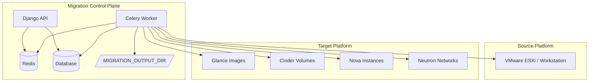

## 9. Repository Structure

```text
vm-migrator/
├── README.md
├── ansible/
│   ├── inventory/hosts.ini
│   └── playbooks/conversion.yml
├── backend/
│   ├── .env.example
│   ├── manage.py
│   ├── core/
│   │   ├── settings.py
│   │   ├── urls.py
│   │   ├── celery.py
│   │   └── logging.py
│   └── migrations/
│       ├── models.py
│       ├── views.py
│       ├── serializers.py
│       ├── tasks.py
│       ├── vmware_client.py
│       ├── openstack_client.py
│       ├── openstack_deployment.py
│       ├── conversion.py
│       ├── disk_formats.py
│       ├── disk_inspection.py
│       ├── filesystem_check.py
│       ├── block_validation.py
│       ├── snapshot_manager.py
│       ├── terraform_runner.py
│       ├── ansible_runner.py
│       ├── tests.py
│       └── management/commands/terraform_apply.py
├── frontend/
│   ├── .env.example
│   ├── package.json
│   ├── vite.config.js
│   ├── eslint.config.js
│   └── src/
│       ├── api/
│       ├── components/
│       ├── pages/
│       ├── App.jsx
│       └── index.css
└── terraform/
    ├── provider.tf
    ├── variables.tf
    ├── network.tf
    ├── security.tf
    ├── outputs.tf
    └── modules/
        ├── base_project/
        ├── network/
        └── security_groups/
```

Directory purpose summary:
- `backend/`: migration API, orchestration, state machine, integrations, and task execution logic.
- `frontend/`: operator console and migration dashboard.
- `terraform/`: reusable OpenStack infrastructure provisioning modules.
- `ansible/`: optional playbook-driven conversion execution.

## 10. Core Workflows

### 10.1 Migration execution workflow

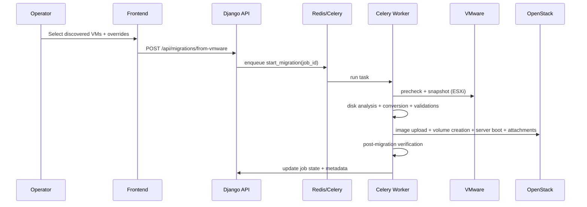

### 10.2 Discovery workflow

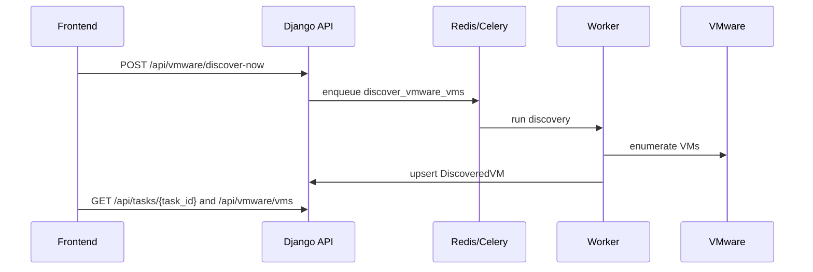

### 10.3 Infra provisioning workflow (optional)

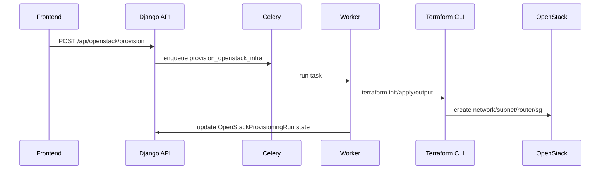

## 11. Installation and Setup

### Prerequisites

Backend/runtime:
- Python 3.x
- Redis server
- Database (SQLite for local; PostgreSQL/MySQL recommended for production)

Worker conversion tools:
- `virt-v2v`
- `qemu-img`
- `virt-filesystems`
- `virt-df`
- `guestfish`
- `fsck`

Optional tools:
- `ansible-playbook`
- `terraform` >= 1.5
- `nbdkit` and VMware VDDK plugin path for ESXi VDDK transport

Frontend:
- Node.js and npm

### Installation Steps

Backend:

```bash
cd backend
python3 -m venv .venv
source .venv/bin/activate
pip install Django djangorestframework djangorestframework-simplejwt \
  celery redis django-environ dj-database-url pyvmomi openstacksdk \
  mysqlclient psycopg2-binary
cp .env.example .env
python manage.py migrate
python manage.py createsuperuser  # set role=SUPER_ADMIN via admin UI or shell after creation
python manage.py runserver 0.0.0.0:8000
```

- After creating the superuser, set its role to `SUPER_ADMIN` (via `/admin` or Django shell) so it can manage users and view all migrations.

Worker:

```bash
cd backend
source .venv/bin/activate
celery -A core worker -l info --concurrency=${CELERY_WORKER_CONCURRENCY:-2}
```

Optional scheduler (periodic discovery):

```bash
cd backend
source .venv/bin/activate
celery -A core beat -l INFO
```

Frontend:

```bash
cd frontend
cp .env.example .env
npm install
npm run dev -- --host
```

Production frontend build:

```bash
cd frontend
npm run build
npm run preview
```

### Environment Setup

Backend env file:
- Copy `backend/.env.example` to `backend/.env`.
- Set secure and environment-specific values (`SECRET_KEY`, `ALLOWED_HOSTS`, DB/Redis/OpenStack/VMware settings).

Frontend env file:
- `VITE_API_BASE_URL=http://<backend-host>:8000`
- Optional dev proxy target: `VITE_PROXY_TARGET`

## 12. Configuration

### 12.1 Backend key configuration groups

| Group | Key Variables | Description |
| --- | --- | --- |
| Core App | `DEBUG`, `SECRET_KEY`, `ALLOWED_HOSTS`, `TIME_ZONE` | Django runtime behavior |
| Data | `DATABASE_URL`, `DB_CONN_MAX_AGE` | DB connectivity and pooling |
| Queue | `REDIS_URL`, Celery limits/concurrency vars | Async task runtime and reliability |
| Discovery | `ENABLE_PERIODIC_DISCOVERY`, `DISCOVERY_*` | Scheduled inventory sync |
| VMware | `VMWARE_WORKSTATION_PATHS`, `VMWARE_ESXI_*`, VDDK/NBDKIT vars | Source endpoint and conversion transport |
| Conversion | `ENABLE_REAL_CONVERSION`, `MIGRATION_OUTPUT_DIR`, `VIRT_V2V_TIMEOUT_SECONDS` | Conversion execution behavior |
| Artifact Backup | `ENABLE_ARTIFACT_BACKUP`, `ARTIFACT_BACKUP_*` | Optional pre-upload artifact retention |
| OpenStack Deploy | `ENABLE_OPENSTACK_DEPLOYMENT`, `OPENSTACK_*`, `OS_*` | Deployment and auth controls |
| Automation | `ENABLE_ANSIBLE_CONVERSION`, `ANSIBLE_*`, `ENABLE_TERRAFORM_*`, `TERRAFORM_*` | Optional automation runners |
| Logging | `LOG_LEVEL`, `LOG_DIR`, rotation sizes/counts | Structured app/worker log output |

### 12.2 Feature flag behavior

| Flag | Default | Behavior |
| --- | --- | --- |
| `ENABLE_REAL_CONVERSION` | `false` | If false, task returns planned conversion (dry-run metadata) |
| `ENABLE_OPENSTACK_DEPLOYMENT` | `false` | If false, conversion pipeline stops before OpenStack deployment |
| `ENABLE_ROLLBACK` | `true` | Enables rollback task scheduling on failure |
| `ENABLE_PERIODIC_DISCOVERY` | `false` | Enables Celery beat discovery schedule |
| `ENABLE_ANSIBLE_CONVERSION` | `false` | Uses Ansible playbook-based conversion path |
| `ENABLE_TERRAFORM_INFRA` | `false` | Allows Terraform provisioning commands/tasks |
| `ENABLE_TERRAFORM_FROM_CELERY` | `false` | Enables API-triggered async Terraform from worker |

### 12.3 Frontend configuration

| Variable | Default | Purpose |
| --- | --- | --- |
| `VITE_API_BASE_URL` | `http://localhost:8000` | API base URL for browser calls |
| `VITE_PROXY_TARGET` | `http://127.0.0.1:8000` | Vite dev proxy target for `/api` |

### 12.4 Authentication & RBAC

- Authentication uses JWT via `djangorestframework-simplejwt`. Access tokens last 30 minutes; refresh tokens last 7 days (see `SIMPLE_JWT` in `backend/core/settings.py` for tuning).
- Default permission is `IsAuthenticated`; only `/api/health` and auth endpoints are public.
- Roles:
  - `SUPER_ADMIN`: manage users, view all migrations, filter by `user_id`, and access any migration detail.
  - `USER`: can register/login, see their own profile, create migrations, and view only their own migrations/dashboard stats.
- Attach `Authorization: Bearer <access_token>` to all non-public requests.

## 13. Usage

### 13.1 API endpoints

Base path: `/api`

| Area | Endpoints |
| --- | --- |
| Auth | `POST /auth/register`, `POST /auth/login`, `POST /auth/refresh`, `GET /auth/me` |
| Health | `GET /health`, `GET /openstack/health` |
| Users | `GET/POST /users/`, `GET/PUT/DELETE /users/{id}` (SUPER_ADMIN only) |
| VMware | `GET /vmware/vms`, `POST /vmware/discover-now`, `POST /vmware/endpoints/test`, `POST /vmware/endpoints/connect` |
| OpenStack | `GET /openstack/images`, `GET /openstack/flavors`, `GET /openstack/networks`, `POST /openstack/endpoints/test`, `POST /openstack/endpoints/connect` |
| Migrations | `GET /migrations`, `GET /migrations/{job_id}`, `POST /migrations/from-vmware`, `POST /migrations/{job_id}/start`, `POST /migrations/{job_id}/rollback` |
| Tasks | `GET /tasks/{task_id}` |
| Provisioning | `POST /openstack/provision`, `GET /openstack/provision/status` |

All endpoints (except `/api/health` and auth routes) require an `Authorization: Bearer <access_token>` header. User management (`/api/users/**`) is restricted to `SUPER_ADMIN` role.

### 13.2 Common workflow commands (curl examples)

Register, login, and grab tokens:

```bash
curl -s -X POST http://127.0.0.1:8000/api/auth/register \
  -H 'Content-Type: application/json' \
  -d '{"username":"alice","email":"alice@example.com","password":"secret123"}'

LOGIN=$(curl -s -X POST http://127.0.0.1:8000/api/auth/login \
  -H 'Content-Type: application/json' \
  -d '{"username":"alice","password":"secret123"}')
ACCESS_TOKEN=$(echo "$LOGIN" | jq -r '.access')
REFRESH_TOKEN=$(echo "$LOGIN" | jq -r '.refresh')

curl -s -X POST http://127.0.0.1:8000/api/auth/refresh \
  -H 'Content-Type: application/json' \
  -d "{\"refresh\":\"${REFRESH_TOKEN}\"}"
```

Use the access token on subsequent requests:

```bash
curl -s http://127.0.0.1:8000/api/dashboard \
  -H "Authorization: Bearer ${ACCESS_TOKEN}"
```

Health check:

```bash
curl -s http://127.0.0.1:8000/api/health
```

Test VMware endpoint:

```bash
curl -s -X POST http://127.0.0.1:8000/api/vmware/endpoints/test \
  -H 'Content-Type: application/json' \
  -d '{"host":"10.0.0.20","port":443,"username":"root","password":"***","insecure":true}'
```

Trigger discovery:

```bash
curl -s -X POST http://127.0.0.1:8000/api/vmware/discover-now \
  -H 'Content-Type: application/json' \
  -d '{"include_workstation":false,"include_esxi":true,"vmware_endpoint_session_id":1}'
```

Create migration jobs:

```bash
curl -s -X POST http://127.0.0.1:8000/api/migrations/from-vmware \
  -H 'Content-Type: application/json' \
  -d '{
    "vmware_endpoint_session_id":1,
    "openstack_endpoint_session_id":3,
    "vms":[{"name":"web-01","source":"esxi","overrides":{"disk_layout_mode":"individual"}}]
  }'
```

Poll job list:

```bash
curl -s http://127.0.0.1:8000/api/migrations
```

Check async task state:

```bash
curl -s http://127.0.0.1:8000/api/tasks/<task_id>
```

### 13.3 UI usage flow

1. Connect VMware endpoint and run discovery.
2. Connect OpenStack endpoint and fetch flavor/network metadata.
3. Select VMs and optional overrides (flavor/CPU/RAM/network/fixed IP/disk layout).
4. Submit migration jobs.
5. Track progress from dashboard and job details.

## 14. Monitoring and Observability

Current observability implemented in repository:
- Structured JSON logging via custom formatter in `core/logging.py`.
- Split app and worker log streams using log filters (`AppLogFilter`, `WorkerLogFilter`).
- Rotating file logs:
  - `backend/logs/app.log`
  - `backend/logs/worker.log`
- Health/status APIs:
  - `/api/health`
  - `/api/openstack/health`
  - `/api/tasks/{task_id}`
  - `/api/openstack/provision/status`

What is not currently present:
- No built-in Prometheus exporter.
- No Grafana dashboard definition in repository.
- No alerting rules shipped in repository.

Recommended enterprise extension:
- Ship logs to centralized platform (ELK/OpenSearch/Splunk).
- Add metrics endpoint and task/job counters by state.
- Add alerting for queue backlog, repeated failures, and conversion/deployment timeout trends.

## 15. Security Considerations

Current security posture from code analysis:
- JWT authentication is enforced by default; only `/api/health` and auth endpoints are public.
- Role-based access: `SUPER_ADMIN` can manage users and view all migrations; regular users are scoped to their own data.
- Endpoint credentials (VMware/OpenStack) are stored in DB model fields.
- SSL verify flags can be disabled (`insecure`, `OS_VERIFY=false`).

Key risks:
- Initial super admin must be created and have `role=SUPER_ADMIN`; otherwise RBAC protections lose enforcement power.
- Plain credential persistence without explicit field encryption in models.
- Sensitive Terraform state file tracked in repository (`terraform/terraform.tfstate`).

Recommended controls:
- Serve the API behind HTTPS and rotate the Django `SECRET_KEY` and JWT signing key if compromised.
- Restrict self-registration in production (disable public exposure or gate it behind admin invite flows).
- Harden token handling: short access lifetime is enabled; consider enabling refresh rotation/blacklisting if needed.
- Restrict API via private network, VPN, or zero-trust gateway.
- Encrypt secrets at rest and use secret manager integration.
- Remove state files and secrets from Git history; manage Terraform state remotely and securely.
- Keep TLS verification enabled in production environments.

## 16. Operations and Maintenance

### 16.1 Service operations

Required long-running services:
- Django API process.
- Celery worker process.
- Redis service.
- Frontend static hosting.

Optional:
- Celery beat for periodic discovery.

### 16.2 Health checks

Operational checks:
- API health: `GET /api/health`
- OpenStack connectivity: `GET /api/openstack/health`
- Task liveness: `GET /api/tasks/{task_id}`
- Log write health: verify app/worker logs are rotating and updating.

### 16.3 Backup and recovery

Recommended:
- Backup DB (jobs, sessions, migration metadata).
- Backup Redis persistence if task history is required.
- Backup migration artifacts when `ENABLE_ARTIFACT_BACKUP=true`.

### 16.4 Upgrade strategy

- Use staged promotion (dev -> staging -> prod).
- Validate migration flows with dry-run mode first.
- Enable risky flags incrementally (`ENABLE_REAL_CONVERSION`, `ENABLE_OPENSTACK_DEPLOYMENT`).

### 16.5 Scaling guidance

- Scale out Celery workers for parallel migrations.
- Tune `CELERY_WORKER_CONCURRENCY` and time limits based on host capacity.
- Separate API host from worker host for CPU/disk isolation.

## 17. Troubleshooting

| Symptom | Likely Cause | Recommended Action |
| --- | --- | --- |
| `No DiscoveredVM found for vm_name=...` | Stale/incorrect inventory session linkage | Re-run discovery with same endpoint session, verify selected source/session IDs |
| ESXi conversion fails requiring `VMWARE_ESXI_*` | Missing worker env vars or endpoint session metadata | Set ESXi vars or ensure endpoint session exists and is selected |
| `libguestfs cannot read host kernel image` | Worker user lacks read permission on `/boot/vmlinuz-*` | Fix host permissions or run worker with proper privileges |
| No QCOW2 output after conversion | `virt-v2v`/toolchain failure or bad output path | Validate `MIGRATION_OUTPUT_DIR`, tool availability, worker disk space, stderr logs |
| OpenStack upload/verify timeout | Slow image/volume/server lifecycle or API path issues | Increase OpenStack timeout vars, validate endpoint override and quotas |
| Provisioning returns `SKIPPED` | Terraform feature flags disabled | Enable `ENABLE_TERRAFORM_INFRA` and `ENABLE_TERRAFORM_FROM_CELERY` as needed |
| Job remains in failed loop | Underlying infra/config issue unresolved | Inspect `conversion_metadata.last_error`, worker logs, and rollback actions |

## 18. Performance and Scalability

Performance-sensitive areas:
- Disk conversion and validation are CPU, disk I/O, and storage-capacity intensive.
- OpenStack image/volume operations are latency-sensitive and may require larger timeouts.
- ESXi source retrieval depends on source platform and transport mode.

Scalability strategies:
- Horizontal worker scaling with queue-based distribution.
- Isolate heavy conversion jobs to dedicated worker pools.
- Use high-throughput storage for `MIGRATION_OUTPUT_DIR`.
- Use robust DB backend (PostgreSQL/MySQL) for production metadata workloads.

Limitations observed:
- No explicit rate limiting or admission control by job size/count.
- No built-in autoscaling logic for workers.
- No built-in metrics-driven performance tuning loop.

## 19. Future Improvements / Roadmap

Recommended roadmap items:
1. Add SSO/OIDC integration, MFA, and finer-grained permission policies.
2. Add encrypted credential storage and secret manager integration.
3. Add native observability stack (metrics, traces, dashboards, alerts).
4. Move Terraform state to remote backend and remove local state from repository.
5. Introduce explicit job scheduling controls (queues, priorities, concurrency by resource class).
6. Expand automated tests for task orchestration, retries, and rollback integrity.
7. Provide containerized deployment artifacts (Docker/Helm/systemd templates).
8. Add API versioning and OpenAPI specification generation.

## 20. Contributing

Suggested contribution workflow:
1. Fork/branch from current mainline.
2. Keep changes scoped and documented.
3. Run frontend lint and backend tests before PR.
4. Include migration and operational impact notes for infrastructure/task-flow changes.
5. Update README/config docs when introducing new env vars, flags, or endpoints.

Local quality checks (available from repository context):
- Frontend lint: `cd frontend && npm run lint`
- Backend tests: `cd backend && python manage.py test`

## 21. License

No license file was detected in the repository at analysis time.

Recommendation:
- Add an explicit license file (`LICENSE`) and reference it here.

## 22. Authors

No explicit author list was detected in the repository metadata/files.

Recommended convention:
- Add maintainers/owners in this section (team name, contact channel, on-call rotation).

---

## Appendix A: Migration State Model

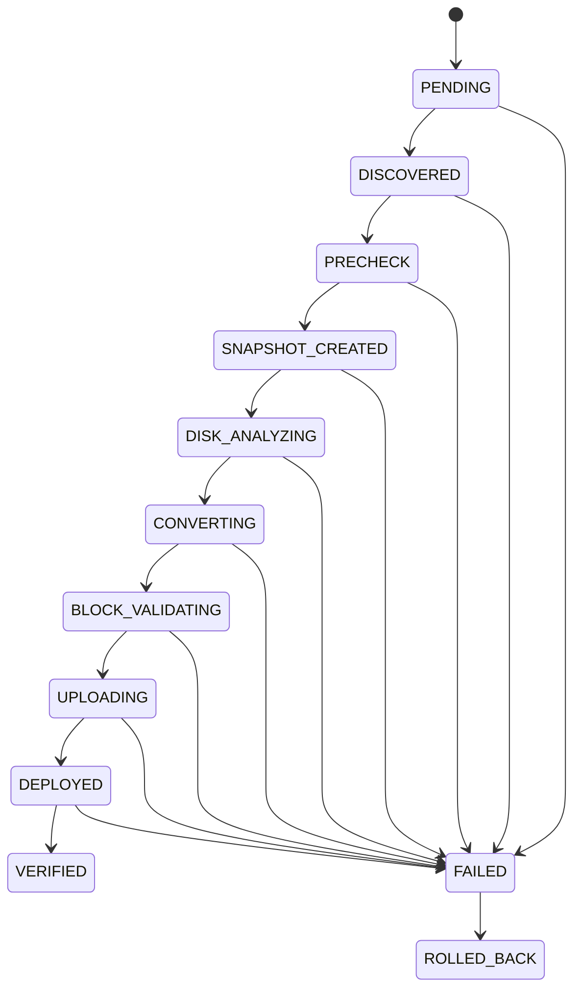

## Appendix B: Terraform Module Map

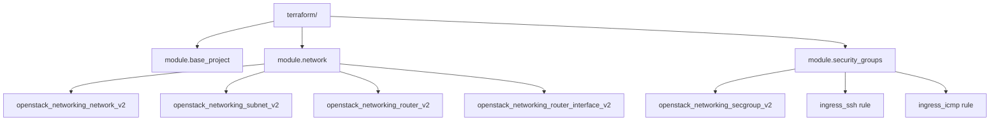
