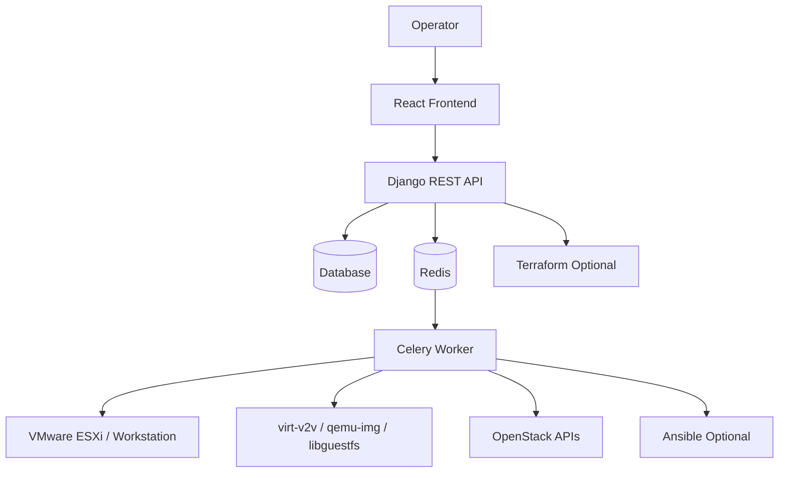
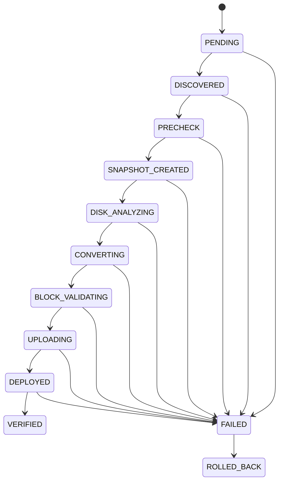
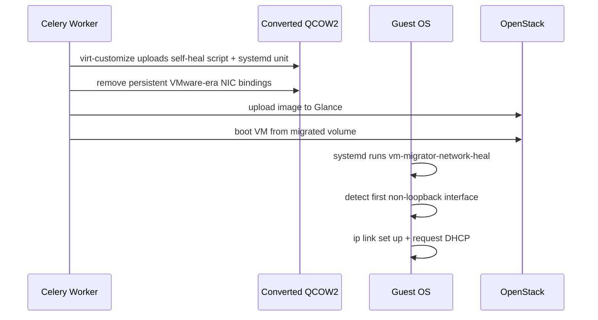
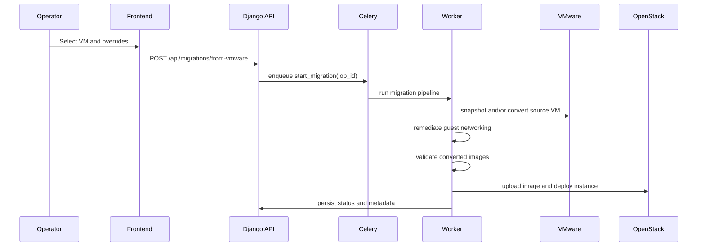
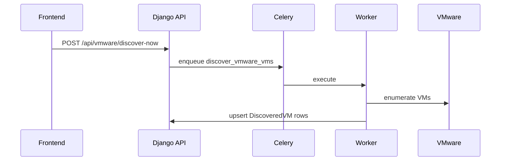
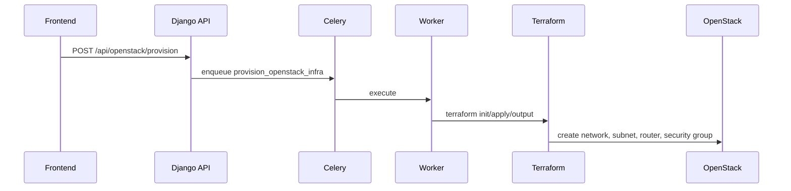
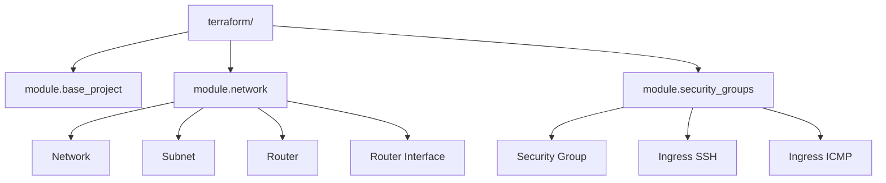

# VM Migrator

VM Migrator is a Django + Celery platform for migrating VMware virtual machines to OpenStack. It supports ESXi and local Workstation/Fusion-style sources, converts disks to OpenStack-friendly formats, validates the resulting images, and can optionally deploy the migrated VM into OpenStack as a boot-from-volume instance.

The current codebase is built around:
- Django REST API for operator workflows and endpoint management
- Celery workers for long-running discovery, conversion, rollback, and provisioning tasks
- `openstacksdk` for Glance, Nova, Cinder, and Neutron operations
- `virt-v2v`, `qemu-img`, and libguestfs tools for conversion and validation
- Optional Terraform and Ansible integrations

For a deeper architecture breakdown, see [docs/architecture.md](/home/amin/Desktop/vm-migrator/docs/architecture.md).

## Quickstart

If you want to get the stack running locally and submit a migration as fast as possible:

1. Start Redis.
2. Start the Django API.
3. Start the Celery worker.
4. Start the frontend.
5. Connect VMware and OpenStack endpoints in the UI.
6. Run discovery, select a VM, and submit the migration.

Backend:

```bash
cd /home/amin/Desktop/vm-migrator/backend
../.venv/bin/python manage.py migrate
../.venv/bin/python manage.py runserver 0.0.0.0:8000
```

Worker:

```bash
cd /home/amin/Desktop/vm-migrator/backend
../.venv/bin/celery -A core worker -l info --concurrency=${CELERY_WORKER_CONCURRENCY:-2}
```

Frontend:

```bash
cd /home/amin/Desktop/vm-migrator/frontend
npm install
npm run dev -- --host
```

Minimum backend environment you will usually want in `backend/.env`:

```env
SECRET_KEY=change-me
DEBUG=True
ALLOWED_HOSTS=127.0.0.1,localhost
DATABASE_URL=sqlite:////home/amin/Desktop/vm-migrator/backend/db.sqlite3
REDIS_URL=redis://127.0.0.1:6379/0
ENABLE_REAL_CONVERSION=false
ENABLE_OPENSTACK_DEPLOYMENT=false
MIGRATION_OUTPUT_DIR=/var/lib/vm-migrator/images
ENABLE_GUEST_NETWORK_REMEDIATION=true
```

## What It Does

- Connects to VMware and OpenStack endpoints
- Discovers source VMs and stores inventory metadata
- Plans and executes disk conversion
- Preserves multi-disk ordering and boot-disk selection
- Validates converted artifacts before deployment
- Uploads images to Glance
- Creates Cinder volumes from migrated images
- Boots Nova instances from volume
- Attaches remaining migrated disks and optional extra volumes
- Verifies the deployment and can roll back failed runs

## Key Migration Behavior

The migration pipeline in the current code looks like this:


## Architecture

High-level system view:



More diagrams and component-level notes live in [docs/architecture.md](/home/amin/Desktop/vm-migrator/docs/architecture.md).

## Repository Layout

```text
vm-migrator/
├── README.md
├── SECURITY_REMEDIATION.md
├── ansible/
│   ├── inventory/hosts.ini
│   └── playbooks/conversion.yml
├── backend/
│   ├── manage.py
│   ├── core/
│   │   ├── celery.py
│   │   ├── logging.py
│   │   ├── settings.py
│   │   └── urls.py
│   ├── migrations/
│   │   ├── ansible_runner.py
│   │   ├── block_validation.py
│   │   ├── conversion.py
│   │   ├── disk_formats.py
│   │   ├── disk_inspection.py
│   │   ├── filesystem_check.py
│   │   ├── models.py
│   │   ├── network_remediation.py
│   │   ├── openstack_client.py
│   │   ├── openstack_deployment.py
│   │   ├── permissions.py
│   │   ├── serializers.py
│   │   ├── snapshot_manager.py
│   │   ├── tasks.py
│   │   ├── terraform_runner.py
│   │   ├── tests.py
│   │   ├── urls.py
│   │   ├── views.py
│   │   └── vmware_client.py
│   └── users/
│       ├── serializers.py
│       ├── urls.py
│       └── views.py
├── frontend/
│   ├── package.json
│   ├── vite.config.js
│   └── src/
└── terraform/
    ├── network.tf
    ├── outputs.tf
    ├── provider.tf
    ├── security.tf
    ├── variables.tf
    └── modules/
```

## Core Components

### Backend

- `backend/migrations/views.py`: REST endpoints for health, endpoint sessions, discovery, migration submission, provisioning, and dashboards
- `backend/migrations/tasks.py`: main migration state machine, rollback flow, discovery task, and provisioning task orchestration
- `backend/migrations/openstack_deployment.py`: idempotent OpenStack upload, volume, server, attachment, and cleanup helpers
- `backend/migrations/network_remediation.py`: guest image remediation using `virt-customize`
- `backend/migrations/conversion.py`: conversion planning
- `backend/migrations/disk_*`: disk format detection, integrity checking, filesystem checks, and layout handling

### Frontend

- VMware endpoint onboarding
- OpenStack endpoint onboarding
- VM selection and migration submission
- Migration list and job detail pages
- Dashboard and OpenStack provisioning controls

### Infrastructure Automation

- Terraform modules for OpenStack network and security-group bootstrap
- Optional Ansible-based conversion execution

## Current Migration State Model



## Guest Network Remediation

One of the main operational issues with VMware to OpenStack migration is guest NIC renaming. A VM that worked on ESXi may boot in OpenStack with a different interface name such as `ens3` instead of `ens33`, leaving the guest without connectivity.

This repository now addresses that at the image stage, before upload to Glance.

### Implemented Strategy

- Converted guest disks are modified with `virt-customize`
- A boot-time self-heal service is injected into the guest
- The script detects the first non-loopback interface dynamically
- It brings the interface up and attempts DHCP with available client tools
- It exits without changes if a default route already exists

### Why This Strategy

- It does not assume `cloud-init` exists inside the migrated guest
- It persists in the image and therefore scales across repeated migrations
- It runs automatically on first boot and remains idempotent
- It avoids hardcoding interface names like `eth0`, `ens3`, or `ens33`

### What Gets Injected

- `/usr/local/sbin/vm-migrator-network-heal`
- `/etc/systemd/system/vm-migrator-network-heal.service`

Optional behavior:
- remove `/etc/udev/rules.d/70-persistent-net.rules`
- remove stale `HWADDR` and `UUID` bindings from RHEL-like `ifcfg-*` files
- optionally write `network: {config: disabled}` under `/etc/cloud/cloud.cfg.d/` when you enable the dedicated setting

### Guest Network Remediation Flow



## OpenStack Deployment Model

The application currently deploys migrated workloads like this:

1. Upload converted QCOW2 or RAW artifacts to Glance
2. Create one Cinder volume per migrated disk
3. Boot the server from the selected boot volume
4. Attach remaining migrated volumes
5. Attach optional extra empty volumes
6. Verify image, volume, server, and attachment health

This means deployment is primarily boot-from-volume, not direct ephemeral boot from image.

## API Surface

Base path: `/api`

### Auth

- `POST /api/auth/register`
- `POST /api/auth/login`
- `POST /api/auth/refresh`
- `GET /api/auth/me`

### Users

- `GET /api/users/`
- `POST /api/users/`
- `GET /api/users/{id}/`
- `PUT /api/users/{id}/`
- `DELETE /api/users/{id}/`

### Health and Dashboard

- `GET /api/health`
- `GET /api/dashboard`
- `GET /api/openstack/health`

### VMware

- `GET /api/vmware/vms`
- `POST /api/vmware/discover-now`
- `POST /api/vmware/endpoints/test`
- `POST /api/vmware/endpoints/connect`
- `GET /api/vmware/endpoints/{id}`
- `POST /api/vmware/endpoints/close`

### OpenStack

- `GET /api/openstack/images`
- `GET /api/openstack/flavors`
- `GET /api/openstack/networks`
- `POST /api/openstack/networks/create`
- `POST /api/openstack/endpoints/test`
- `POST /api/openstack/endpoints/connect`
- `GET /api/openstack/endpoints/{id}`
- `POST /api/openstack/endpoints/close`
- `POST /api/openstack/provision`
- `GET /api/openstack/provision/status`

### Migrations and Tasks

- `GET /api/migrations`
- `POST /api/migrations`
- `GET /api/migrations/{job_id}`
- `POST /api/migrations/from-vmware`
- `POST /api/migrations/{job_id}/start`
- `POST /api/migrations/{job_id}/rollback`
- `GET /api/tasks/{task_id}`

## Main Workflows

### Submit a Migration



### Discover VMware Inventory



### Provision OpenStack Networking



## Installation

### Requirements

Backend runtime:
- Python 3.11+ recommended
- Redis
- SQLite for local development or PostgreSQL/MySQL for production

Worker tools:
- `virt-v2v`
- `qemu-img`
- `virt-inspector`
- `virt-filesystems`
- `virt-df`
- `guestfish`
- `virt-customize`
- `fsck`

Optional:
- `terraform`
- `ansible-playbook`
- `nbdkit`
- VMware VDDK libraries for VDDK transport

Frontend:
- Node.js
- npm

### Python Environment

This repository already contains a root virtual environment at `.venv`, and the current test runs in this repo used that environment.

If you need to recreate it:

```bash
cd /home/amin/Desktop/vm-migrator
python3 -m venv .venv
source .venv/bin/activate
pip install Django djangorestframework djangorestframework-simplejwt \
  celery redis django-environ dj-database-url django-cryptography \
  pyvmomi openstacksdk mysqlclient psycopg2-binary
```

### Backend Startup

```bash
cd /home/amin/Desktop/vm-migrator/backend
../.venv/bin/python manage.py migrate
../.venv/bin/python manage.py createsuperuser
../.venv/bin/python manage.py runserver 0.0.0.0:8000
```

### Celery Worker

```bash
cd /home/amin/Desktop/vm-migrator/backend
../.venv/bin/celery -A core worker -l info --concurrency=${CELERY_WORKER_CONCURRENCY:-2}
```

### Optional Celery Beat

```bash
cd /home/amin/Desktop/vm-migrator/backend
../.venv/bin/celery -A core beat -l INFO
```

### Frontend

```bash
cd /home/amin/Desktop/vm-migrator/frontend
npm install
npm run dev -- --host
```

### Production Frontend Build

```bash
cd /home/amin/Desktop/vm-migrator/frontend
npm run build
npm run preview
```

## Configuration

Environment variables are loaded from `backend/.env` if present.

### Core

| Variable | Purpose |
| --- | --- |
| `SECRET_KEY` | Django secret and encryption basis |
| `DEBUG` | Django debug mode |
| `ALLOWED_HOSTS` | Allowed hostnames |
| `TIME_ZONE` | App and Celery timezone |
| `DATABASE_URL` | Database connection string |
| `REDIS_URL` | Celery broker and result backend |

### Celery and Reliability

| Variable | Purpose |
| --- | --- |
| `CELERY_WORKER_CONCURRENCY` | Worker process concurrency |
| `CELERY_TASK_SOFT_TIME_LIMIT` | Soft task timeout |
| `CELERY_TASK_TIME_LIMIT` | Hard task timeout |
| `CELERY_WORKER_PREFETCH_MULTIPLIER` | Celery prefetch behavior |

### Discovery

| Variable | Purpose |
| --- | --- |
| `ENABLE_PERIODIC_DISCOVERY` | Enable beat-scheduled discovery |
| `DISCOVERY_INTERVAL_SECONDS` | Discovery cadence |
| `DISCOVERY_INCLUDE_WORKSTATION` | Include workstation sources |
| `DISCOVERY_INCLUDE_ESXI` | Include ESXi sources |

### Conversion and Artifact Handling

| Variable | Purpose |
| --- | --- |
| `ENABLE_REAL_CONVERSION` | Enable real conversion instead of dry-run |
| `MIGRATION_OUTPUT_DIR` | Output directory for generated images |
| `VIRT_V2V_TIMEOUT_SECONDS` | Conversion timeout |
| `ENABLE_ARTIFACT_BACKUP` | Copy artifacts before upload |
| `ARTIFACT_BACKUP_DIR` | Backup destination |
| `ARTIFACT_BACKUP_REQUIRED` | Fail if backup cannot be created |

### Guest Network Remediation

| Variable | Default | Purpose |
| --- | --- | --- |
| `ENABLE_GUEST_NETWORK_REMEDIATION` | `true` | Enable pre-upload guest image remediation |
| `GUEST_NETWORK_REMEDIATION_TIMEOUT_SECONDS` | `300` | `virt-customize` timeout |
| `GUEST_NETWORK_DISABLE_CLOUD_INIT_NETWORK_CONFIG` | `false` | Optionally disable cloud-init network rendering in guest images |

### OpenStack Deployment

| Variable | Purpose |
| --- | --- |
| `ENABLE_OPENSTACK_DEPLOYMENT` | Enable deployment after conversion |
| `OPENSTACK_CLOUD_NAME` | Named cloud config fallback |
| `OPENSTACK_DEFAULT_NETWORK` | Preferred Neutron network |
| `OPENSTACK_IMAGE_ENDPOINT_OVERRIDE` | Force Glance endpoint override |
| `OPENSTACK_VERIFY_TIMEOUT` | Deployment verification timeout |
| `OPENSTACK_IMAGE_UPLOAD_TIMEOUT` | Glance upload timeout |
| `OPENSTACK_API_RETRIES` | OpenStack API retry count |
| `OPENSTACK_API_RETRY_DELAY` | Retry backoff |

### Terraform and Ansible

| Variable | Purpose |
| --- | --- |
| `ENABLE_TERRAFORM_INFRA` | Enable Terraform provisioning features |
| `ENABLE_TERRAFORM_FROM_CELERY` | Run provisioning via worker |
| `TERRAFORM_BIN` | Terraform binary |
| `TERRAFORM_WORKING_DIR` | Terraform root directory |
| `ENABLE_ANSIBLE_CONVERSION` | Use Ansible conversion path |
| `ANSIBLE_BIN` | Ansible playbook binary |
| `ANSIBLE_PLAYBOOK_PATH` | Playbook location |
| `ANSIBLE_INVENTORY_PATH` | Inventory location |

## Auth and RBAC

- JWT auth is implemented with `djangorestframework-simplejwt`
- `Register`, `Login`, and `Refresh` are public
- All other routes require authentication
- `SUPER_ADMIN` can manage users and view all migration data
- `USER` is scoped to their own jobs, sessions, and dashboards

## Operational Notes

### ESXi Constraints

- ESXi VM migration requires the source VM to be powered off
- ESXi snapshot creation is supported in the pipeline
- VDDK transport needs host-side `nbdkit` and VMware libraries when enabled

### Worker Host Requirements

- sufficient local disk space under `MIGRATION_OUTPUT_DIR`
- read access to host kernel files required by libguestfs/supermin
- working OpenStack and VMware network access from the worker

### OpenStack Notes

- image upload is performed through `create_image(filename=...)`
- deployment uses boot-from-volume helpers
- post-migration validation checks images, server status, flavor capacity, volumes, and disk attachments

## Logging and Observability

The app already includes:
- JSON structured logging
- separate app and worker log filters
- rotating file handlers
- task status endpoint
- OpenStack health endpoint

Log files:
- `backend/logs/app.log`
- `backend/logs/worker.log`

Not included by default:
- Prometheus metrics
- Grafana dashboards
- alert rules

## Security Notes

Current implementation details:
- endpoint credentials are stored in encrypted model fields using `django-cryptography`
- JWT is required for non-public endpoints
- TLS verification can be disabled for lab environments but should stay enabled in production

Recommendations:
- use a strong, unique `SECRET_KEY`
- place the API behind HTTPS
- avoid public self-registration in production
- move secrets to a secret manager for production
- keep Terraform state out of Git and use a secure remote backend
- review `SECURITY_REMEDIATION.md` after any secret exposure

## Troubleshooting

| Symptom | Likely Cause | Action |
| --- | --- | --- |
| No discovered VM found for a job | wrong session or stale discovery data | rerun discovery with the same endpoint session |
| `virt-v2v` fails early | worker toolchain or permission issue | verify conversion tools, logs, and host permissions |
| `libguestfs cannot read host kernel image` | worker cannot read `/boot/vmlinuz-*` | fix file permissions or worker privileges |
| QCOW2 output missing after conversion | output path or conversion failure | inspect worker logs and free space |
| Migrated VM boots without network | guest image still has stale NIC bindings | confirm guest remediation is enabled and `virt-customize` is installed |
| OpenStack image upload fails | bad Glance endpoint or auth issue | verify endpoint override and OpenStack session |
| Server deploy hangs in verify | slow image, volume, or compute operations | raise OpenStack timeout settings and check cloud quotas |

## Testing

Backend tests:

```bash
cd /home/amin/Desktop/vm-migrator/backend
../.venv/bin/python manage.py test
```

Frontend lint:

```bash
cd /home/amin/Desktop/vm-migrator/frontend
npm run lint
```

Current backend suite status at the time this README was updated:
- `42` tests passing

## Terraform Module View



## Roadmap

- add richer task metrics and dashboards
- add OpenAPI documentation
- support more explicit scheduling and queue isolation
- improve packaging and deployment artifacts
- optionally add cloud-init `user_data` support for images known to have cloud-init installed

## License

No `LICENSE` file is present in the repository at the time of this update.
